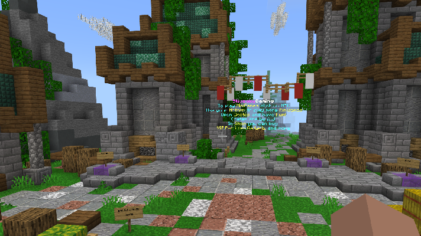

# SlivockyStats
> Create custom Stats and FloatingTexts for PM Server.
Support some Minigames. Planned to extend support soon!



## Installation

Only PocketMine:
On server must be installed DevTools to run it or compile!

```sh
makeplugin SlivockyStats
```

## Hot to configure plugin

#Main Messages, Texts</br>
#Use \n to make new line, §c, §a, §b, §l... to make collors</br>
#Interval to show texts in SECONDS
```sh
MainInterval: 25
AboutText:
  enable: "true"
  title: "SlivockyStats"
  text: "§aHi everybody!"
  x: 0
  y: 0
  z: 0
  level: "world"
BasicTexts:
  enable: "true"
  title1: "Text1"
  text1: "§aGG!"
  x1: 2
  y1: 2
  z1: 2
  title2: "Text2"
  text2: "§aHaloo!"
  x2: 1
  y2: 1
  z2: 1
  level: "world"
```

#To enable type "true"</br>
#To disable "false"</br>
#HungerGames
```sh
HungerGames:
  enable: "false"
  kills:
    x: 160
    y: 100
    z: 160
  wons:
    x: 180
    y: 100
    z: 180
  level: "world"
```

_For more examples and usage, please write me [Discord][https://discord.gg/tJ9wDRR]._


## Release History

* 1.0.2
    * ADD: Add BasicTexts
* 1.0.0
    * FIX: Support MultiWorld servers
* 0.1.0
    * The first unofficial, private release
* 0.0.1
    * Work in progress

## Contact

Alemiz – [Discord](https://discord.gg/tJ9wDRR) – alemiz@mizerak.eu

Distributed under the Apache license. See ``LICENSE`` for more information.

[https://github.com/yourname/github-link](https://github.com/dbader/)
